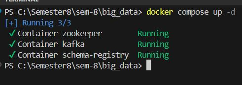
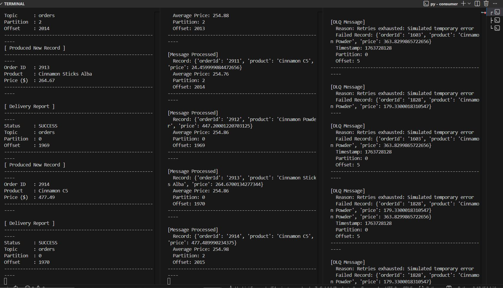

# Kafka Order Processing System - Big Data Assignement 1

This project implements a distributed Kafka-based system to produce and consume **order messages** with the following features:

- **Avro Serialization** for structured messages.
- **Real-time aggregation** (running average of order prices).
- **Retry logic** for temporary failures.
- **Dead Letter Queue (DLQ)** for permanently failed messages.
- Demonstrates a working Kafka producer and consumer.

---

## Order Message Schema (`order.avsc`)

| Field   | Type   | Description                     |
|---------|--------|---------------------------------|
| orderId | string | Unique identifier for the order |
| product | string | Name of the purchased item      |
| price   | float  | Price of the product            |


## How to Run
### 1. Start Kafka cluster
```bash
docker-compose up -d
```

### 2. Install Python dependencies
```bash
pip install -r requirements.txt
```
### 3.Run the Producer
```bash
cd producer
python producer.py
```

### 4.Run the Consumer and DLQ Consumer
```bash
cd consumer
python consumer.py
python dlq_consumer.py
```
## Features

### 1. Avro Serialization
- Uses `fastavro` for schemaless writing and reading.
- Ensures consistent message structure.

### 2. Running Average
- Consumer keeps a running sum and count of prices.
- Updates and prints average price in real-time.

### 3. Retry Logic
- Temporary errors are retried up to 3 times.
- Permanent errors are directly sent to the Dead Letter Queue (DLQ).

### 4. Dead Letter Queue (DLQ)
- Captures all permanently failed messages.
- Provides reason, timestamp, and failed record details.

### Output for order processing system



